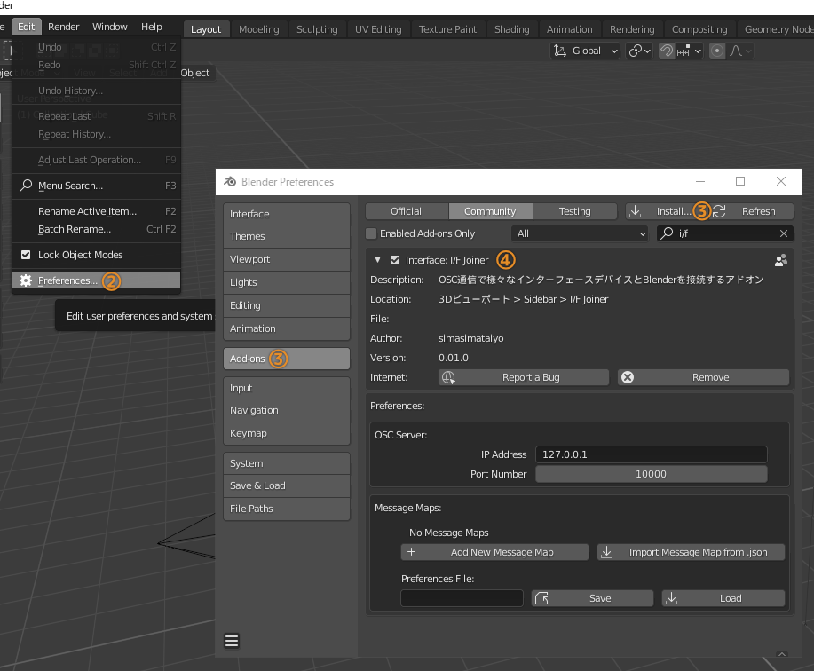
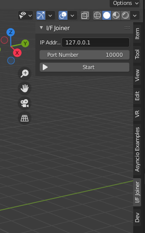
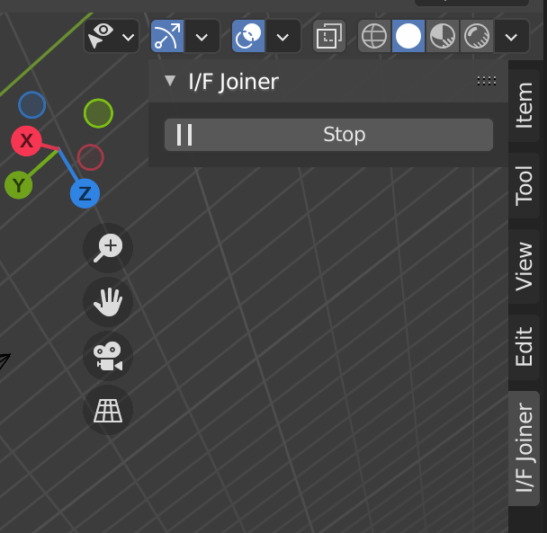
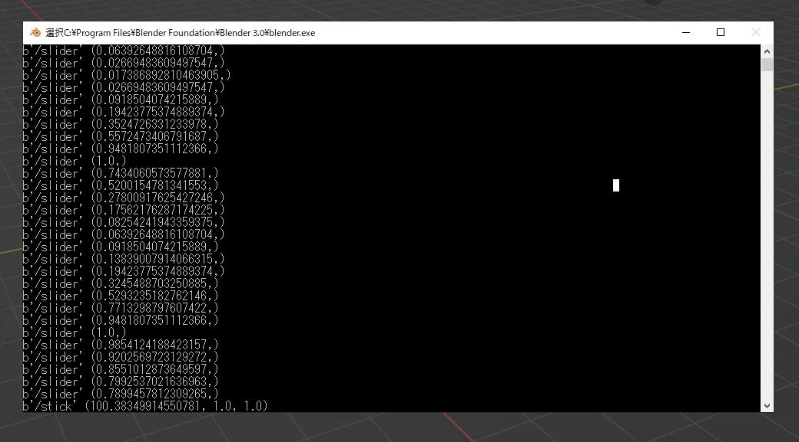
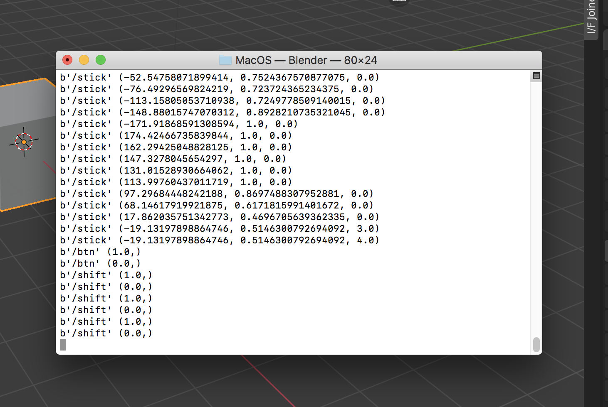
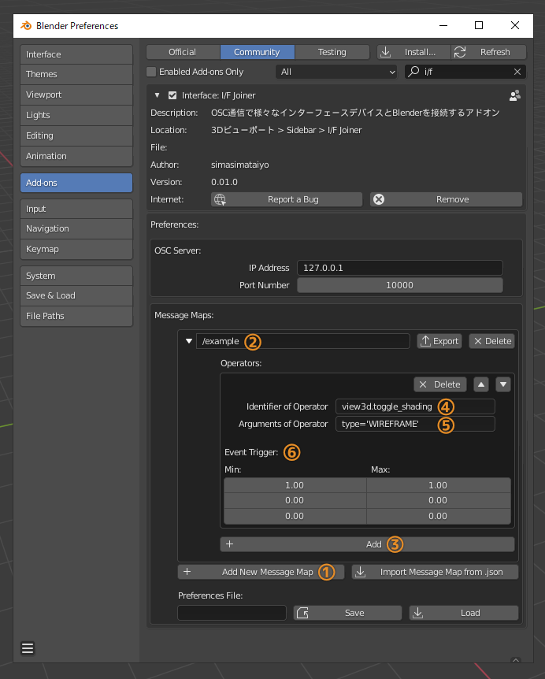
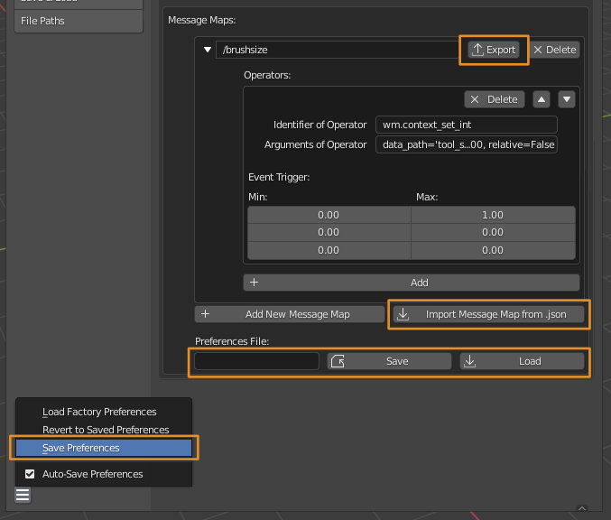
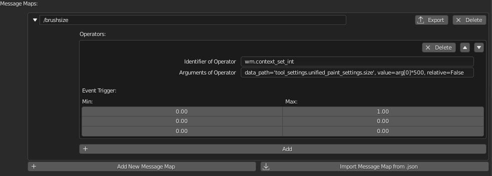
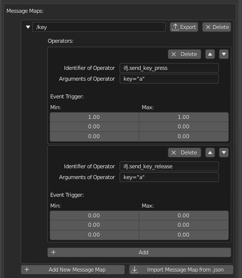

# I/F Joiner

受信したOSCメッセージに応じてオペレータ（bpy.ops）を実行するアドオンです．
OSC通信に対応したコントローラやアプリをインストールしたスマートフォンを使用してBlenderを操作することが可能になります．

同時開発しているAndroidコントローラ化アプリ[Mocopa](https://github.com/simasimataiyo/Mocopa)は当アドオンと併せた使用がおすすめです．

# Feature
- OSCメッセージの受信
- 受信したOSCメッセージに応じて実行するオペレータの割り当て設定
  - OSCメッセージの引数をオペレータの引数に代入可能
- 割り当て設定のエクスポートやインポート（JSON形式）
- Blender 2.8以降に対応
  - Windowsでの使用を推奨します．Macでも動作しますが頻繁にクラッシュするようです．

# Install

1. [Releases Page](https://github.com/simasimataiyo/IFJoiner/releases)からzipファイルをダウンロード
   
2. Blenderを起動しトップバーから「Edit」→「Preference」を開く
3. Preferenceウィンドウ左側メニューから「Addon」→ウィンドウ右上「Install」ボタンをクリックしダウンロードしたzipファイルをインストール
4. 「Community」が選択された状態で**Interface: I/F Joiner**がアドオンリストに追加されていること確認したら，チェックを入れて有効化する．

# How to Use
## OSCサーバの起動と停止

アドオンをインストールすると，3DViewのプロパティシェルフに「I/F Joiner」タブが追加されます．

IP AddressにBlenderを起動しているPCのIPアドレス，Port Numberに任意のポート番号を入力し「Start」をクリックしてOSCサーバを起動します．Windowsでは初回起動時にファイアウォールのポップアップが表示されることがあります．その場合は「アクセスを許可する」をクリックしてください．

サーバが起動するとOSCメッセージの受信を開始します．

停止させる際は「Stop」をクリックします

## 受信したOSCメッセージの確認方法
### Windowsの場合

トップバー「Window」→「Toggle System Console」でコマンドプロンプトを開きます．
OSCサーバが起動した状態でOSCメッセージを受信するとアドレスパターンと引数がそれぞれ表示されます．

### Macの場合

ターミナルからBlenderを起動します．

Blenderがアプリケーションフォルダにインストールされている場合はターミナルに以下を入力してBlenderを起動します．

`/Applications/Blender.app/Contents/MacOS/Blender`

OSCサーバが起動した状態でOSCメッセージを受信するとアドレスパターンと引数がターミナルにそれぞれ表示されます．

## 受信したOSCメッセージに対するオペレータの割り当て

1. I/FJoinerのPreferenceを表示し，Message Mapsの **「Add Message Map」** をクリックして割り当て設定を一つ追加します．

2. 追加されたボックスの入力欄に機能を割り当てたいメッセージのアドレスパターンを入力します．
3. 左端の三角形をクリックするとメニューが展開します．「Add」をクリックして実行するオペレータを一つ追加します．

4. Keymapの設定と同様に，実行するオペレータのIdentifierを入力し指定します．
   公式ドキュメントでは各オペレータは`bpy.ops.hogehoge()`の形で記載されていますが，先頭のbpy.opsと末尾の()を切り取った`hogehoge`がIdentifierになります．
   > `bpy.ops.view3d.toggle_shading(type='WIREFRAME')` → `view3d.toggle_shading`

5. 実行するオペレータの引数を入力します．OSCメッセージに含まれる引数を渡すことが可能です．
   OSCメッセージに含まれる引数の先頭から順にarg[0], arg[1], arg[2]...でアクセスできます．
   > `type='HOGEHOGE', value=arg[0]`
   
6. オペレータを実行する条件を設定します．OSCメッセージに含まれる引数のうち先頭から最大3つまで，何れもFloatの値であり3つの引数全てが最大値・最小値の範囲内にあるとき（min ≦ arg ≦ max）オペレータが実行されます．Event TriggerのMin・Maxに上から引数の順に範囲を入力してください．

Blenderで提供されるオペレータは以下の公式ドキュメントを参照してください．

https://docs.blender.org/api/current/bpy.ops.html

一つのアドレスパターンに対し複数のオペレータを設定することが可能です．実行条件が同一な複数のオペレータを設定した場合は，条件に合致したオペレータがリストの上から順に実行されます．

## 割り当ての保存と読み込み

Message Mapの割り当てを編集したら，**必ず「Save」をクリック**してPreference Fileを保存してください．

また左下ハンバーガーメニューの「Save Preference」でPreference Fileのファイルパスを保存すると，次回起動時は保存したファイルから自動的に設定が読み込まれます．**初回起動時は必ず「Save Preference」をクリック**してください．

「Load」からも保存したPreference Fileを読み込めます．バックアップや割り当ての共有に利用できます．

また各Message MapはJSON形式でエクスポート・インポートが可能です．Templateフォルダに割り当てサンプルがあるので「Import Message Map from .json」から読み込んでみてください．

## Tips
### オペレータの引数に四則計算した値を代入する
オペレータの引数を設定する入力フォーム内で値の四則計算が可能です．
OSCメッセージに含まれる引数に対して使うと便利です．
> `value = arg[0] * 485 + 583`

### パラメータを変更する
例えばスカルプトブラシの大きさなど，パラメータを変更したい場合はWm Operatorsの`bpy.ops.wm.context_set_int()`や`bpy.ops.wm.context.set_float()`を使用します．

詳しくは以下の公式ドキュメントを参考にしてください．
https://docs.blender.org/api/current/bpy.ops.wm.html

設定例です．

### キー入力をシミュレートする
I/F Joinerはキー入力をシミュレートするオペレータを提供します．以下の3つです．
- ifj.send_key_press(key='keyname')
  - 引数で設定したキーを押します．

- ifj.send_key_release(key='keyname')
  - 引数で設定したキーを離します．
  
- ifj.send_key_press_and_release(key='keyname')
  - 引数で設定したキーを押して離します．

Aキーをシミュレートする設定例です．

### オペレータを自作して登録する
`Blenderのアドオン保存フォルダ/ifjoiner/custom_operators`にクラス名が`IFJ_`から始まるオペレータを書いた.pyファイルを置いておくと自動的に登録されます．

## Credits
### 使用させていただいたライブラリ ###
- [OSCpy](https://github.com/kivy/oscpy
  )
- [keyboard](https://github.com/boppreh/keyboard)
  
### 参考にさせていただいたアドオン ###
- [AddRoutes](http://www.jpfep.net/pages/addroutes/)

  
  OSC通信に加えてMIDI通信も可能なBlenderの各パラメータを操作することができるアドオンです．

### 参考にさせていただいたサイト ###
- [はじめてのBlenderアドオン開発](https://colorful-pico.net/introduction-to-addon-development-in-blender/2.8/index.html)
  
  Blenderアドオン開発を1から詳しく解説されています．

